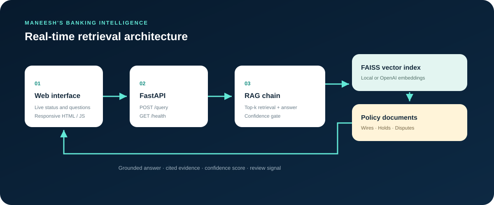

# Banking Policy & Compliance RAG Assistant



A real-time Retrieval-Augmented Generation (RAG) application for banking policy questions. The responsive frontend sends live requests to FastAPI and returns grounded answers, confidence scores, and the exact policy excerpts used as evidence.

## Built by

**Maneesh** — full-stack AI application development, retrieval architecture, API integration, and frontend experience.

## Features

- Answers questions about wire transfers, account holds, and disputes.
- Retrieves relevant chunks from a persisted FAISS index.
- Supports zero-key local mode and an OpenAI-backed mode.
- Shows cited policy evidence and match scores for every answer.
- Flags low-confidence responses for human review.
- Reports API, provider, and index status in the UI every 30 seconds.
- Serves the frontend and API from one deployable application.

## Architecture

```text
Browser UI ── POST /query ──> FastAPI ──> RAG chain ──> FAISS index
    ^                                             │          │
    └── answer + confidence + cited sources ─────┘     policy docs

Browser UI ── GET /health ──> provider and index readiness
```

The editable source illustration is [`docs/architecture.svg`](docs/architecture.svg).

## Run in real time

### Windows PowerShell

```powershell
python -m venv venv
.\venv\Scripts\Activate.ps1
pip install -r requirements.txt
Copy-Item .env.example .env
python -m app.build_index
uvicorn app.main:app --reload
```

### macOS or Linux

```bash
python3 -m venv venv
source venv/bin/activate
pip install -r requirements.txt
cp .env.example .env
python -m app.build_index
uvicorn app.main:app --reload
```

Open **http://127.0.0.1:8000** for the application or **http://127.0.0.1:8000/docs** for the API reference.

The default `LLM_PROVIDER=local` setting needs no API key. It uses deterministic local embeddings and an extractive answerer, so the entire UI-to-RAG flow works offline.

## Use OpenAI generation

Set these values in `.env`, rebuild the index, and restart the server:

```dotenv
LLM_PROVIDER=openai
OPENAI_API_KEY=your_api_key
OPENAI_CHAT_MODEL=gpt-4o-mini
OPENAI_EMBEDDING_MODEL=text-embedding-3-small
```

Never commit `.env` or an API key.

## API

`GET /health` returns the provider and index readiness.

`POST /query` accepts:

```json
{
  "question": "What is the fee for an outgoing domestic wire transfer?",
  "top_k": 4
}
```

The response contains `answer`, `grounded`, `confidence`, and `sources`.

## Docker

```bash
docker compose up --build
```

Then open **http://127.0.0.1:8000**.

## Tests

```bash
python -m pytest -v
```

## Project structure

```text
app/                FastAPI, RAG, ingestion, embeddings, and FAISS
data/sample_docs/   Example banking policy knowledge base
docs/               Architecture image and project visuals
tests/              API, ingestion, and embedding tests
ui/index.html       Responsive real-time frontend
```

## Safety model

This is a reference assistant, not a replacement for policy owners or legal/compliance review. Answers below the confidence threshold are marked for human review, and every response exposes its supporting evidence.

## License

MIT — see [LICENSE](LICENSE).
