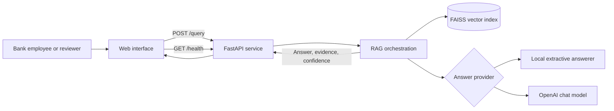
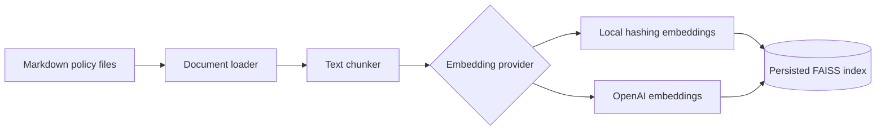
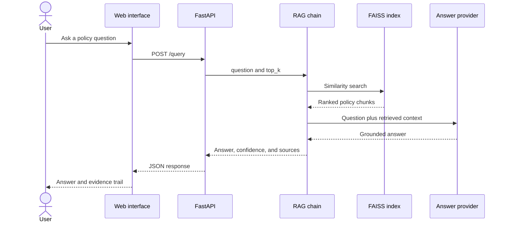

# System Architecture

## Overview

The Banking Policy & Compliance RAG Assistant separates document indexing from live question answering. This keeps requests fast and lets the knowledge base be rebuilt independently whenever policies or embedding models change.

## System context



## Indexing workflow



Run the indexing workflow with `python -m app.build_index`. Rebuild the index after changing source documents, chunk settings, the embedding provider, or the embedding model.

## Runtime query workflow



## Component responsibilities

| Component | Location | Responsibility |
| --- | --- | --- |
| API service | `app/main.py` | Exposes health and query endpoints and serves the UI. |
| Configuration | `app/config.py` | Loads provider, model, path, and retrieval settings. |
| Ingestion | `app/ingestion.py` | Loads source documents and creates searchable chunks. |
| Embeddings | `app/embeddings.py` | Selects deterministic local or OpenAI embeddings. |
| Vector store | `app/vectorstore.py` | Builds, persists, loads, and searches the FAISS index. |
| RAG chain | `app/rag_chain.py` | Retrieves evidence, generates answers, and calculates confidence. |
| API models | `app/models.py` | Defines validated request and response schemas. |
| Web interface | `ui/index.html` | Presents questions, status, answers, and citations. |

## Design decisions

### Offline-first development

Local hashing embeddings and extractive answers make the application usable without external services. OpenAI mode is enabled through configuration without application code changes.

### Persisted retrieval index

FAISS is built outside the request path and stored on disk. Runtime requests search the existing index, reducing latency and avoiding repeated embedding work.

### Evidence-first responses

Every response contains source chunks and similarity scores. A confidence threshold determines whether an answer is grounded or requires human review.

### Explicit module boundaries

Configuration, ingestion, embeddings, storage, orchestration, transport, and presentation are separate modules. Each layer can be replaced without rewriting the full application.

## Deployment

```text
Client -> FastAPI container -> FAISS index on local storage
                         `-> OpenAI API (optional)
```

For multi-instance production deployments, use a shared vector service and add authentication, authorization, audit logging, rate limiting, managed secrets, and observability.

## Extension points

- Replace FAISS with a managed vector database.
- Add hybrid keyword and semantic retrieval.
- Add reranking before answer generation.
- Ingest PDF, DOCX, or content-management sources.
- Add role-based filtering for restricted policies.
- Add evaluation datasets for retrieval quality and groundedness.
